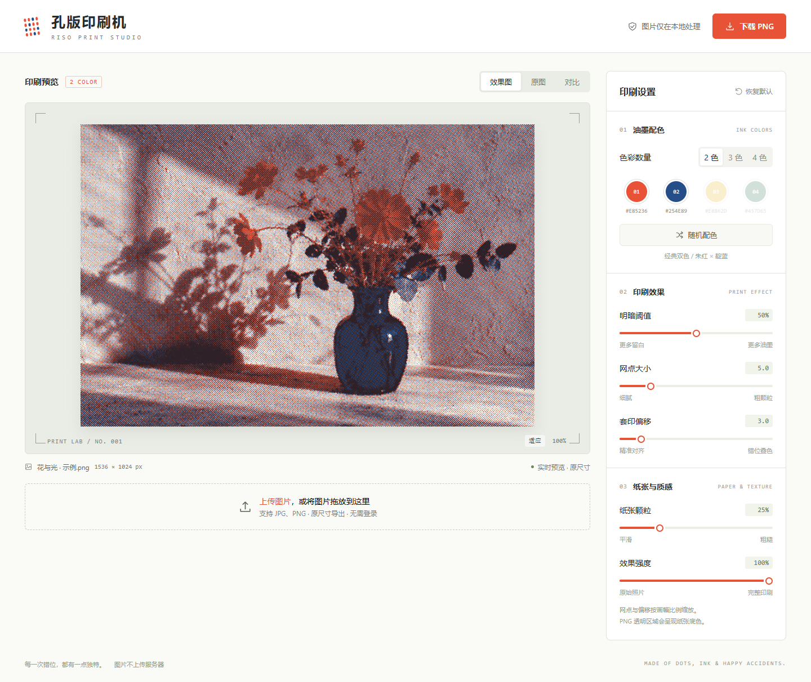

# 孔版印刷机 · Riso Print Studio

把 JPG、PNG 变成 2—4 色孔版印刷效果的单页图像编辑器。零运行依赖，图片只在浏览器本地处理。



## 直接运行

下载仓库后，用现代浏览器打开 `index.html` 即可。无需安装、联网、登录或配置服务器。示例照片、样式、脚本和本地兼容渲染器都包含在一个 HTML 文件中。

需要 HTTP 预览时，安装 Node.js 后运行：

```sh
node server.cjs
```

打开终端显示的 `http://127.0.0.1:4178`。

## 使用

1. 上传 JPG、PNG，或把图片拖入编辑器。
2. 选择 2、3、4 色，点击油墨色块修改颜色。
3. 调整明暗阈值、网点大小、套印偏移、纸张颗粒和效果强度，预览立即更新。
4. 选择“原图”或“对比”检查处理前后；对比模式支持拖动分界线。
5. 点击“下载 PNG”，导出与原图相同宽高的图片。

“随机配色”使用内置油墨组合；“恢复默认”还原全部印刷参数。“适应”完整显示画面，“100%”显示原始像素并允许滚动，始终保留原图比例。

## 渲染与隐私

- WebGL 为每种油墨生成独立网点层，再叠加偏移和纸张纹理。WebGL 不可用时，自动使用本地 Worker 兼容渲染。
- 预览与导出使用原图尺寸，不截取界面、不拉伸照片、不放大缩略图。网点大小和偏移按画幅比例计算。
- PNG 透明区域合成到纸张底色上。效果强度为 0 时保留原图颜色。
- 图片读取、渲染及 PNG 编码全部在浏览器中完成，不上传服务器，不使用外部字体、统计脚本或远程图片。
- 极大图像受设备内存和浏览器 Canvas 尺寸上限约束；无法导出时会显示提示。

## 项目结构

```text
index.html        完整应用与内嵌示例照片
server.cjs        可选本地预览服务器
docs/preview.png  编辑器截图
```

修改 `index.html` 即可调整界面、油墨预设与滤镜算法。示例照片为 AI 生成的静物图，已内嵌在 HTML 中。

## 已验证

七项参数的像素变化、PNG/JPEG 上传、随机配色、恢复默认、原图比较、原尺寸 PNG 导出、比例、390 像素宽手机布局、离线运行及 Worker 兼容渲染均已通过检查。

部分支持 WebMCP 的浏览器可使用 `set_print_parameters` 调整相同参数。此接口经过注册替身验证；原生 WebMCP 环境验证暂不可用，常规浏览器使用不受影响。

## 许可证

本项目采用 [MIT 许可证](LICENSE)。Copyright (c) 2026 德里克文。
